# GCP Retail Solution

This repo contains utility code for the [Redis Enterprise Session Stability Store Solution Brief.](https://www.google.com) <br>
They are for demonstration purposes and not meant for production.  <br><br>

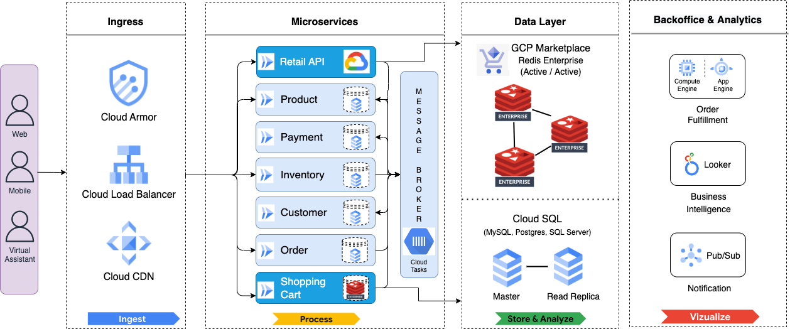  
  
The above architecture depicts a microservice architecture for a retail / e-commerce application on Google Cloud Platform. The incoming eCommerce traffic comes through Google Cloud Load Balancer along with Cloud Armor to safeguard against DDoS and application attacks from intruders and with Cloud CDN to accelerate content delivery to end users while reducing serving costs.   
<br>
The incoming requests get processed by the microservices hosted on containers in Google Cloud Run scalable serverless environments. Individual microservices can scale in or out based on real-time workload requirements without overprovisioning unused resources. The product catalog, inventory system, customer profile, etc are stored in fully managed database services such as CloudSQL and third-party Redis Enterprise fully managed services to provide a persistent store and a real-time session store respectively.   
<br>
The backoffice custom or packaged applications such as order fulfillment and management systems are hosted on various Google computing environments such as Google Compute Engine and Google App Engine. Google Cloud Looker is an important strategic component in Google Cloud Platform visualization suite to help retailers improve productivity, increase decision-making capabilities, and promote innovations by delivering more insights.

   
## Pre-requisites
Prior to running this retail application, please ensure following pre-requisites are installed and configured.

- [gcloud CLI](https://cloud.google.com/sdk/docs/install)
- [yq - YAML/XML processor](https://pypi.org/project/yq/)
<br><br>


## High Level Workflow
The following is the high level workflow which you will follow:
1. Clone this repo on to your local system
2. Set up a Redis Enterprise Active-Active subscription on Google Cloud Platform
3. Build a docker image for the Cloud Run services hosting the retail application
4. Create a VPC network, VPC subnets and VPC connectors for private service access
5. Peer Redis's VPC in each region to your VPC network
6. Create a CloudSQL (MySQL) Master/Replica pair instances for storing the product catalog
7. Populate product data into the MySQL database (named acme)
8. Deploy Cloud Run services running the retail application
9. Create a load balancer for the retail application serving in two GCP regions
10. Access the retail application via the load balancer's endpoint
11. Tear down the environment


   
#### 1. Clone this repo
```
git clone https://github.com/Redislabs-Solution-Architects/gcp-retail-solution
cd gcp-retail-solution
```


#### 2. Set up a Redis Enterprise Active-Active subscription on Google Cloud Platform
Create an active-active subscription in GCP:   
For this setup, you will pick **us-east1** and **us-west1** GCP regions as follows:    
In this example, we use 10.70.0.0 and 10.80.0.0 for the two GCP regions. If either of them overlaps with any of your existing subnets in VPC which will be peered with the subscription, please choose a different set of CIDRs for your deployment.   
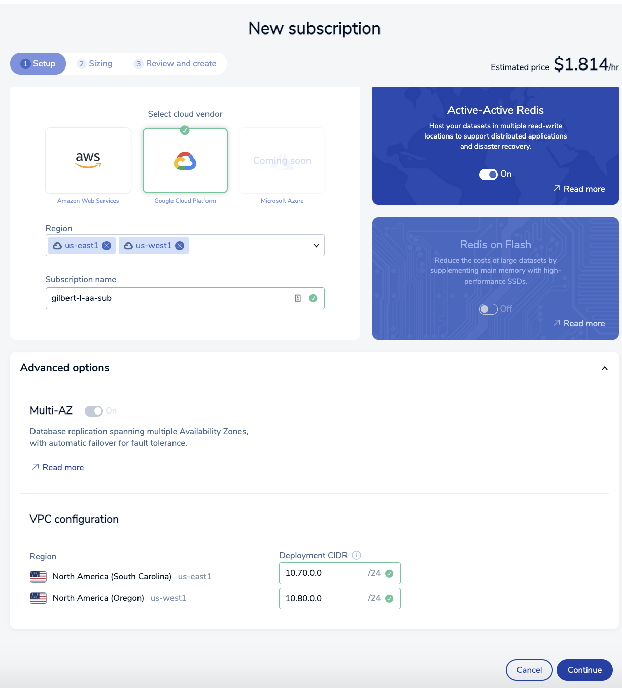  
  
Configure the two Conflict-Free Replicated Database (CRBD) instances:
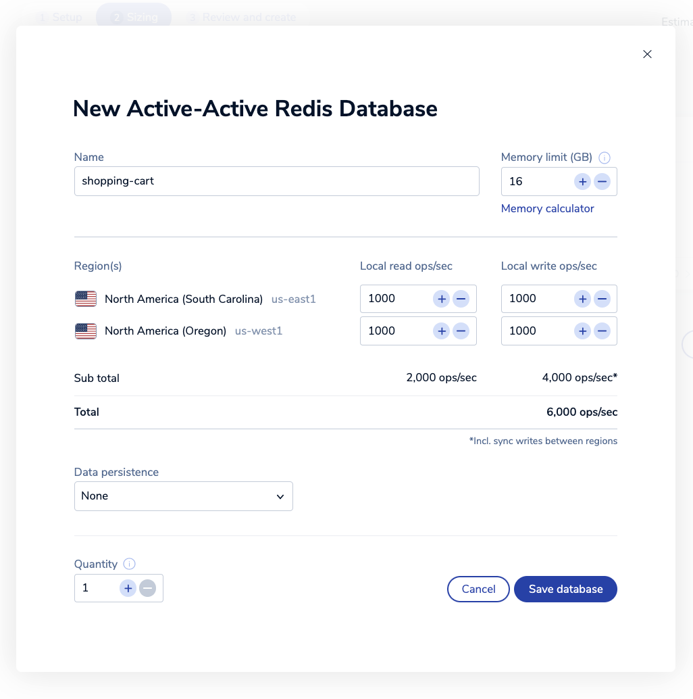
 
The database configuration confirmation page should look like the following:
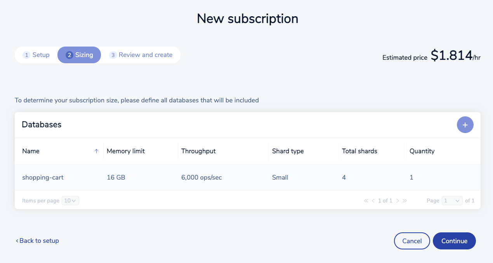

The subscription confirmation page should look like the following:
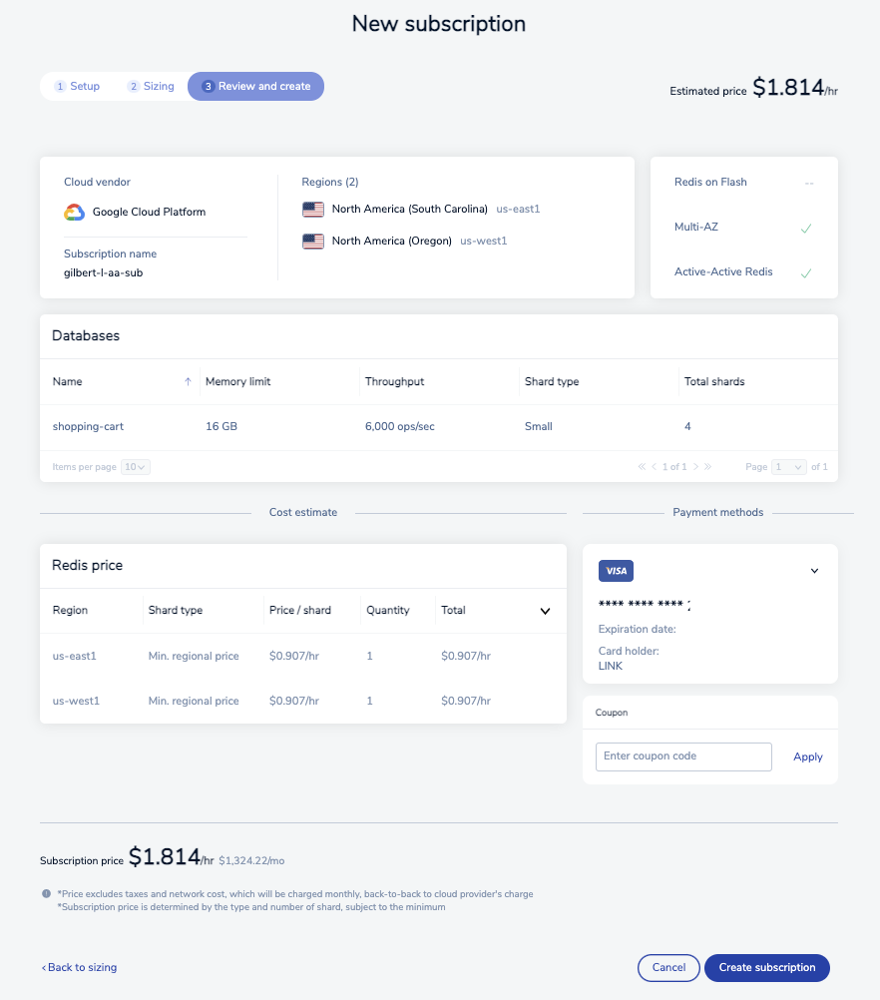
  
It will take about 5 - 10 minutes to provision the subscription.   
Upon completion, you will go into each database's details to collect their private endpoint and default user's password:
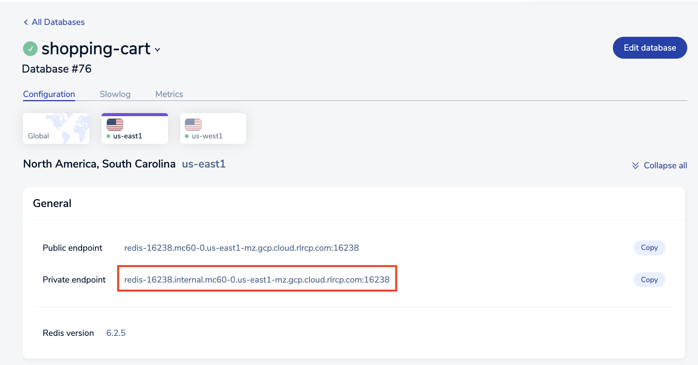    
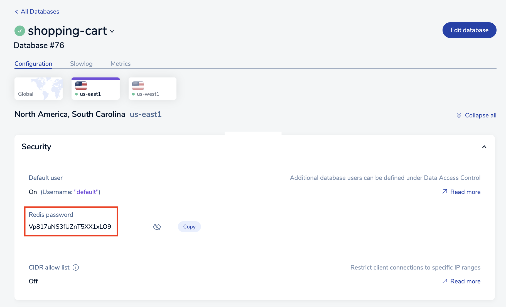     
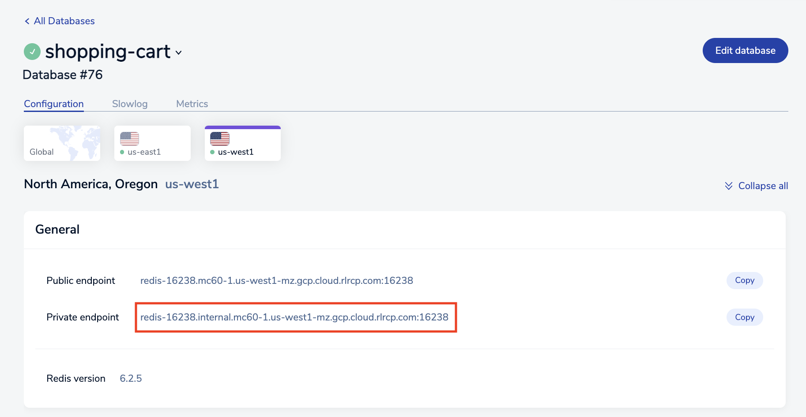   
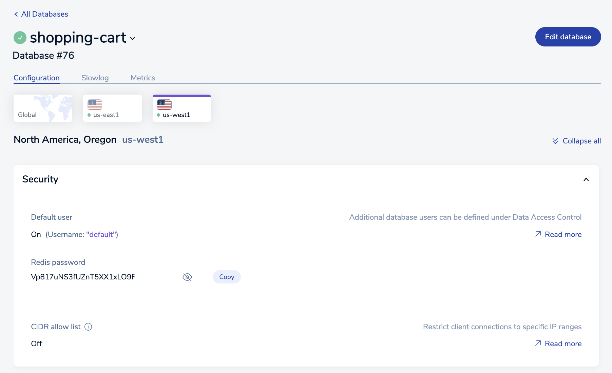   
  


#### 3. Build a docker image for the Cloud Run services hosting the retail application
```
export PROJECT_ID=$(gcloud config get-value project)
pushd cloudrun-redis

gcloud builds submit --tag gcr.io/$PROJECT_ID/redis-retail-app

popd
```


#### 4. Create a VPC network, VPC subnets, VPC connectors for private service access, and CloudSQL private service access  
*Note: The create_vpc.sh script below will create a subnet in us-east1 region using 10.50.0.0/24 and a subnet in us-west1 region using 10.60.0.0/24 address spaces. If they conflict with the CIDRs in your Redis Enterprise Active-Active deployment above or any of your existing subnets in your VPC to be peered with your Redis Enterprise subscription, please update the script accordingly before running the commands below:*  
```
pushd gcloud

export vpc_network=redis-retail-vpc
export vpc_subnet_east=redis-retail-vpc-us-east1
export vpc_connector_east=redis-retail-us-east1
export vpc_subnet_west=redis-retail-vpc-us-west1
export vpc_connector_west=redis-retail-us-west1

./create_vpc.sh $vpc_network \
	$vpc_subnet_east $vpc_connector_east \
	$vpc_subnet_west $vpc_connector_west \
	$PROJECT_ID

popd
```


#### 5. Peer Redis's VPC in each region to your VPC network
Inside Redis Console, find your subscription created earlier and select the "Connectivity" tab:  
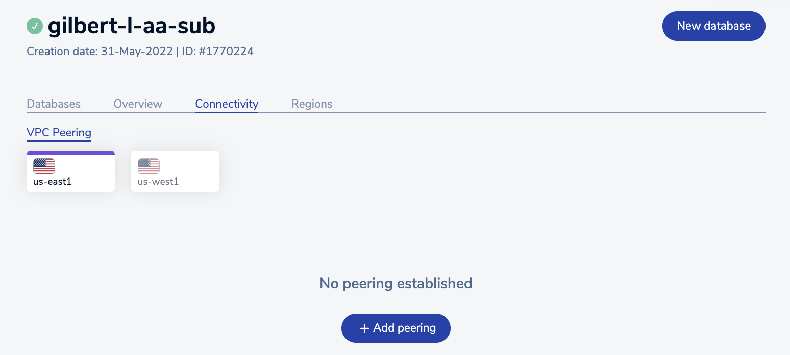  
  
Select us-east1 region and create a VPC peering:  
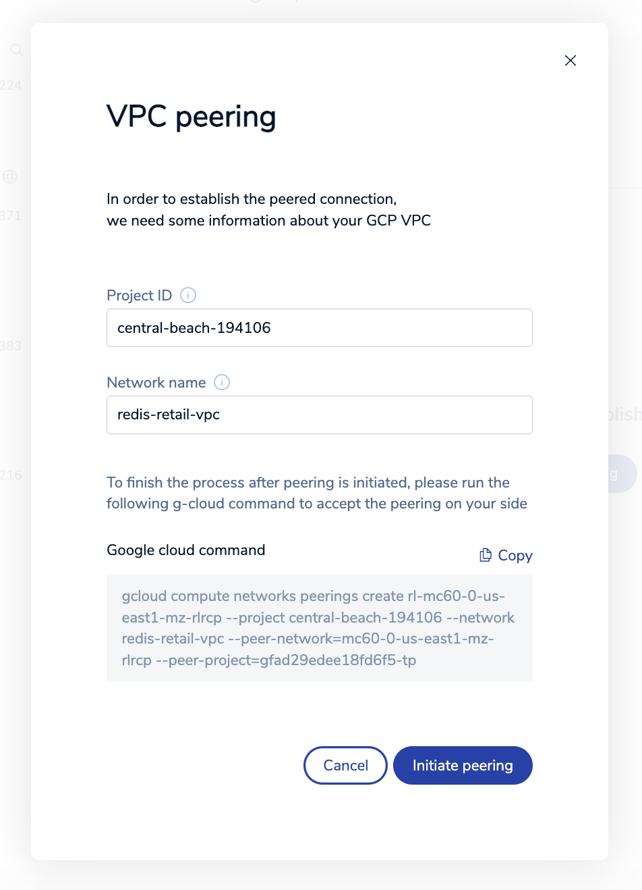  
  
Once it is successfully peered, the peering status will turn GREEN:  
  
  
Continue to peer the us-west1 region as follows:  
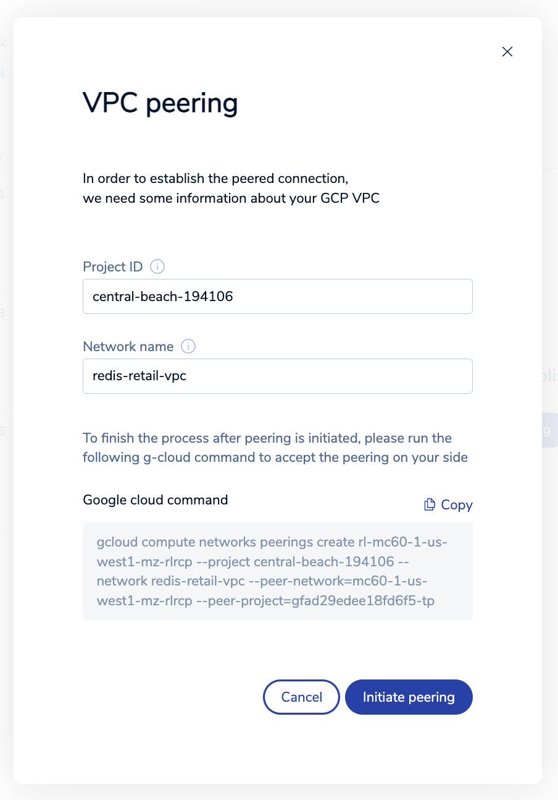    
  


#### 6. Create a CloudSQL (MySQL) Master/Replica pair instances for storing the product catalog
```
pushd gcloud

export cloudsql_master=redis-retail-product-master
export cloudsql_replica=redis-retail-product-replica

./create_cloudsql.sh $cloudsql_master $cloudsql_replica $vpc_network

popd
```
It will take about 10 minutes or so to provision both Master and Replica MySQL instances.  
Next, collect the private IP address for the MySQL Master and Replica instances:   
Run the command below to collect the Master instance's private IP address endpoint for Cloud Run service in us-east1 region for use later by env_vars_us_east1.yaml:    
```
gcloud sql instances describe $cloudsql_master | yq eval '.ipAddresses[] | select(.type == "PRIVATE") | .ipAddress'
```
  
Run the command below to collect the Replica instance's private IP address endpoint for Cloud Run service in us-west1 region for use later by env_vars_us_west1.yaml:
```
gcloud sql instances describe $cloudsql_replica | yq eval '.ipAddresses[] | select(.type == "PRIVATE") | .ipAddress'
```   
Or, you can look up the private IP addresses in GCP console like below:
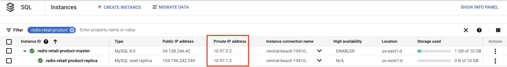   
You would likely have different private IP addresses for your MySQL Master and Replica instances.   

  

#### 7. Populate product data into the MySQL database (named acme)
```
pushd gcloud

./product_db.sh $cloudsql_master

popd
```


#### 8. Deploy Cloud Run services running the retail application
```
pushd gcloud
```
Update env_vars_us_east1.yaml & env_vars_us_westt1.yaml before deploying the cloud run services:
The four fields below are specific to your environment:
```
REDISHOST :
REDISPORT :
REDISPASSWORD :
MYSQL_DATABASE_HOST :

For example,
REDISHOST : redis-15429.internal.mc52-0.us-east1-mz.gcp.cloud.rlrcp.com
REDISPORT : "15429"
REDISPASSWORD : qIxNLFFH1kYXFB12hUqjAQLMg0ntahz1z
MYSQL_DATABASE_HOST : 10.24.222.8

```
Now, deploy the two Cloud Run services:
```
export app_image=gcr.io/$PROJECT_ID/redis-retail-app
export cloudrun_east=redis-retail-svc-east1
export cloudrun_west=redis-retail-svc-west1

./create_cloudrun.sh $app_image \
        $cloudrun_east $vpc_connector_east $cloudsql_master \
        $cloudrun_west $vpc_connector_west $cloudsql_replica
```
```
popd
```


#### 9. Create a load balancer for the retail application serving in two GCP regions
Create network endpoint groups:
```
export neg_east=glau-retail-neg-east
export neg_west=glau-retail-neg-west

gcloud compute network-endpoint-groups create $neg_east \
        --region=us-east1 \
        --network=$vpc_network \
        --network-endpoint-type=serverless \
        --cloud-run-service=$cloudrun_east

gcloud compute network-endpoint-groups create $neg_west \
        --region=us-west1 \
        --network=$vpc_network \
        --network-endpoint-type=serverless \
        --cloud-run-service=$cloudrun_west
```
  
Create backend service:
```
export backend_svc=redis-retail-backend-svc

gcloud compute backend-services create $backend_svc \
        --global \
        --protocol=HTTPS \
        --port-name=http

gcloud compute backend-services add-backend $backend_svc \
        --network-endpoint-group=$neg_east \
        --network-endpoint-group-region=us-east1 \
        --global

gcloud compute backend-services add-backend $backend_svc \
        --network-endpoint-group=$neg_west \
        --network-endpoint-group-region=us-west1 \
        --global
```
  
Reserve a static IP address:
```
export lb_ipv4=redis-retail-lb-ip
gcloud compute addresses create $lb_ipv4 \
        --ip-version=IPV4 \
        --network-tier=PREMIUM \
        --global
```
  
Create the load balancer's URL Map:
```
export url_map=redis-retail-lb
gcloud compute url-maps create $url_map \
        --default-service=$backend_svc \
        --global

export http_lb_proxy=redis-retail-http-lb-proxy
gcloud compute target-http-proxies create $http_lb_proxy \
        --url-map=$url_map

export http_content_rule=redis-retail-http-content-rule
gcloud compute forwarding-rules create $http_content_rule \
        --load-balancing-scheme=EXTERNAL \
        --address=$lb_ipv4 \
        --global \
        --target-http-proxy=$http_lb_proxy \
        --ports=80
```


#### 10. Access the retail application via the load balancer's endpoint
It will take about 5 minutes or so before the load balancer can serve the application.  
Run the following command to retrieve the IP address of the endpoint:
```
gcloud compute addresses describe $lb_ipv4 \
	--format="get(address)" \
	--global
```
Then, access the retail application via the endpoint: http://\<endpoint-ip-address\> .  
This is the home page of the Retail App:  
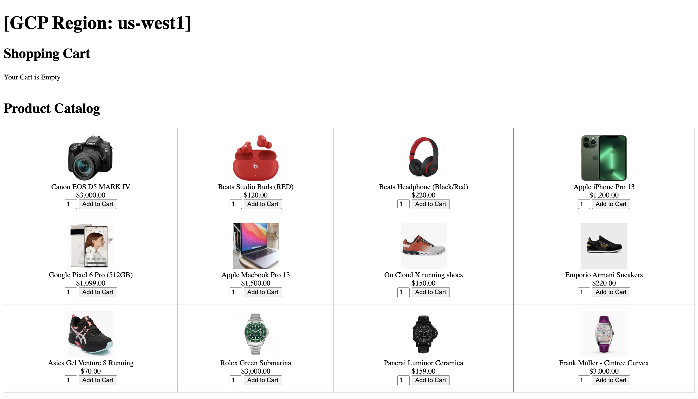  
After putting items into the shopping cart, it will look like the following:   
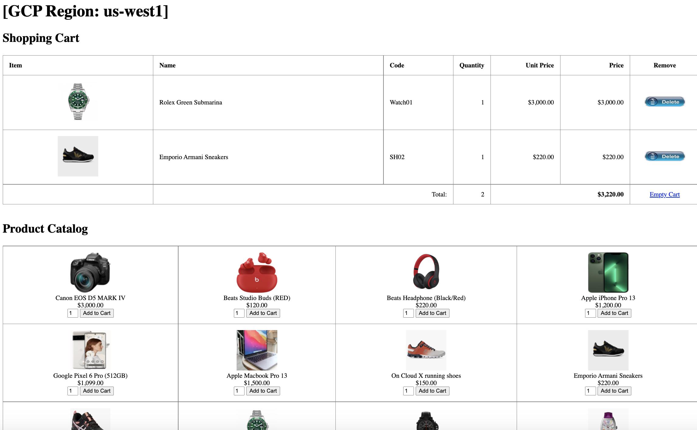


#### 11. Tear down the environment
```
pushd gcloud
./tear_down.sh
popd
```   
   
Finally, delete your Redis Enterprise Active-Active subscription.
   


