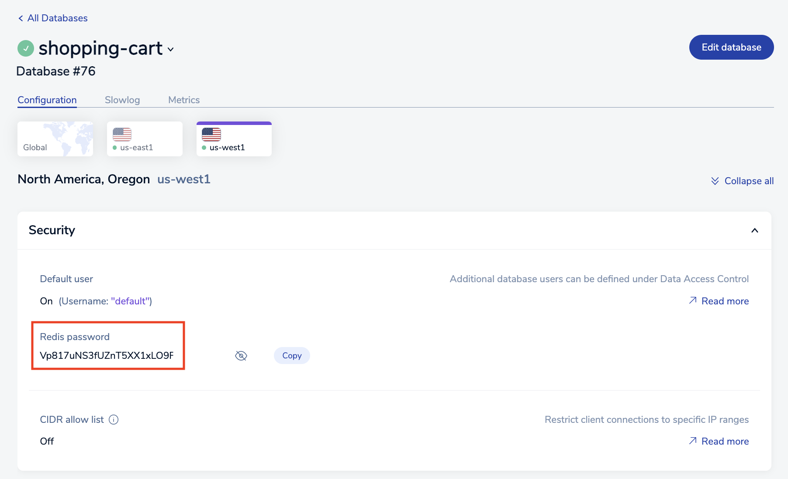

# GCP Retail Solution

This repo contains utility code for the [Redis Enterprise Session Stability Store Solution Brief.](https://www.google.com) <br>
They are for demonstration purposes and not meant for production.  <br><br>


## Pre-requisites
Prior to running this retail application, please ensure following pre-requisites are installed and configured.

- [gcloud CLI](https://cloud.google.com/sdk/docs/install)
- [yq - YAML/XML processor](https://pypi.org/project/yq/)
<br><br>


## High Level Workflow
The following is the high level workflow which you will follow:
1. Clone this repo on to your local system
2. Set up a Redis Enterprise Active-Active subscription on Google Cloud Platform
3. Build a docker image for the Cloud Run services hosting the retail application
4. Create a VPC network, VPC subnets and VPC connectors for private service access
5. Peer Redis's VPC in each region to your VPC network
6. Create a CloudSQL (MySQL) Master/Replica pair instances for storing the product catalog
7. Populate product data into the MySQL database (named acme)
8. Deploy Cloud Run services running the retail application
9. Create a load balancer for the retail application serving in two GCP regions
10. Access the retail application via the load balancer's endpoint
11. Tear down the environment


   
#### 1. Clone this repo
```
git clone https://github.com/Redislabs-Solution-Architects/gcp-retail-solution
cd gcp-retail-solution
```


#### 2. Set up a Redis Enterprise Active-Active subscription on Google Cloud Platform
Create an active-active subscription in GCP:  
  
  
Configure the two Conflict-Free Replicated Database (CRBD) instances:

 
The database configuration confirmation page should look like the following:


The subscription confirmation page should look like the following:

  
It will take about 5 - 10 minutes to provision the subscription.   
Upon completion, you will go into each database's details to collect their private endpoint and default user's password:
    
     
   
   
  


#### 3. Build a docker image for the Cloud Run services hosting the retail application
```
export PROJECT_ID=$(gcloud config get-value project)
pushd cloudrun-redis

gcloud builds submit --tag gcr.io/$PROJECT_ID/redis-retail-app

popd
```


#### 4. Create a VPC network, VPC subnets, VPC connectors for private service access, and CloudSQL private service access
```
pushd gcloud
export vpc_network=redis-retail-vpc
export vpc_subnet_east=redis-retail-vpc-us-east1
export vpc_connector_east=redis-retail-us-east1
export vpc_subnet_west=redis-retail-vpc-us-west1
export vpc_connector_west=redis-retail-us-west1

./create_vpc.sh $vpc_network $vpc_subnet_east $vpc_connector_east $vpc_subnet_west $vpc_connector_west $PROJECT_ID

popd
```


#### 5. Peer Redis's VPC in each region to your VPC network
Inside Redis Console, find your subscription created earlier and select the "Connectivity" tab:  
  
  
Select us-east1 region and create a VPC peering:  
  
  
Once it is successfully peered, the peering status will turn GREEN:  
  
  
Continue to peer the us-west1 region as follows:  
    
  


#### 6. Create a CloudSQL (MySQL) Master/Replica pair instances for storing the product catalog
```
pushd gcloud
export cloudsql_master=redis-retail-product-master
export cloudsql_replica=redis-retail-product-replica

./create_cloudsql.sh $cloudsql_master $cloudsql_replica $vpc_network

popd
```
Next, collect the private IP address for the MySQL Master and Replica instances:  
Run the command below to collect the Master instance's private IP for Cloud Run service in us-east1 region for use later by env_vars_us_east1.yaml:    
```
gcloud sql instances describe $cloudsql_master | yq eval '.ipAddresses[] | select(.type == "PRIVATE") | .ipAddress'
```
  
Run the command below to collect the Replica instance's private IP for Cloud Run service in us-west1 region for use later by env_vars_us_west1.yaml:
```
gcloud sql instances describe $cloudsql_replica | yq eval '.ipAddresses[] | select(.type == "PRIVATE") | .ipAddress'
```
  

#### 7. Populate product data into the MySQL database (named acme)
```
pushd gcloud

./product_db.sh $cloudsql_master

popd
```


#### 8. Deploy Cloud Run services running the retail application
```
pushd gcloud
```
Update env_vars_us_east1.yaml & env_vars_us_westt1.yaml before deploying the cloud run services:
The four fields below are specific to your environment:
```
REDISHOST :
REDISPORT :
REDISPASSWORD :
MYSQL_DATABASE_HOST :

For example,
REDISHOST : redis-15429.internal.mc52-0.us-east1-mz.gcp.cloud.rlrcp.com
REDISPORT : "15429"
REDISPASSWORD : qIxNLFFH1kYXFB12hUqjAQLMg0ntahz1z
MYSQL_DATABASE_HOST : 10.24.222.8

```
Now, deploy the two Cloud Run services:
```
export app_image=gcr.io/$PROJECT_ID/redis-retail-app
export cloudrun_east=redis-retail-svc-east1
export cloudrun_west=redis-retail-svc-west1

./create_cloudrun.sh $app_image \
        $cloudrun_east $vpc_connector_east $cloudsql_master \
        $cloudrun_west $vpc_connector_west $cloudsql_replica
```
```
popd
```


#### 9. Create a load balancer for the retail application serving in two GCP regions
Create network endpoint groups:
```
pushd gcloud
```
```
export neg_east=glau-retail-neg-east
export neg_west=glau-retail-neg-west

gcloud compute network-endpoint-groups create $neg_east \
        --region=us-east1 \
        --network=$vpc_network \
        --network-endpoint-type=serverless \
        --cloud-run-service=$cloudrun_east

gcloud compute network-endpoint-groups create $neg_west \
        --region=us-west1 \
        --network=$vpc_network \
        --network-endpoint-type=serverless \
        --cloud-run-service=$cloudrun_west
```
  
Create backend service:
```
export backend_svc=redis-retail-backend-svc

gcloud compute backend-services create $backend_svc \
        --global \
        --protocol=HTTPS \
        --port-name=http

gcloud compute backend-services add-backend $backend_svc \
        --network-endpoint-group=$neg_east \
        --network-endpoint-group-region=us-east1 \
        --global

gcloud compute backend-services add-backend $backend_svc \
        --network-endpoint-group=$neg_west \
        --network-endpoint-group-region=us-west1 \
        --global
```
  
Reserve a static IP address:
```
export lb_ipv4=redis-retail-lb-ip
gcloud compute addresses create $lb_ipv4 \
        --ip-version=IPV4 \
        --network-tier=PREMIUM \
        --global
```
  
Create the load balancer's URL Map:
```
export url_map=redis-retail-lb
gcloud compute url-maps create $url_map \
        --default-service=$backend_svc \
        --global

export http_lb_proxy=redis-retail-http-lb-proxy
gcloud compute target-http-proxies create $http_lb_proxy \
        --url-map=$url_map

export http_content_rule=redis-retail-http-content-rule
gcloud compute forwarding-rules create $http_content_rule \
        --load-balancing-scheme=EXTERNAL \
        --address=$lb_ipv4 \
        --global \
        --target-http-proxy=$http_lb_proxy \
        --ports=80
```
```
popd
```


#### 10. Access the retail application via the load balancer's endpoint
Run the following command to retrieve the IP address of the endpoint:
```
gcloud compute addresses describe $lb_ipv4 \
	--format="get(address)" \
	--global
```
Then, access the retail application via the endpoint: http://<endpoint-ip-address> .


#### 11. Tear down the environment
```
pushd gcloud

Work In Progress

popd
```

